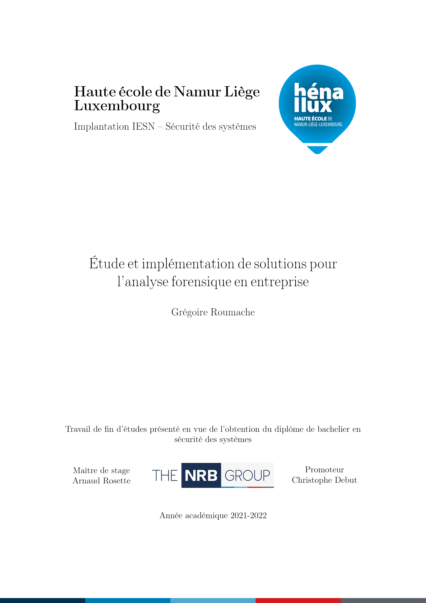
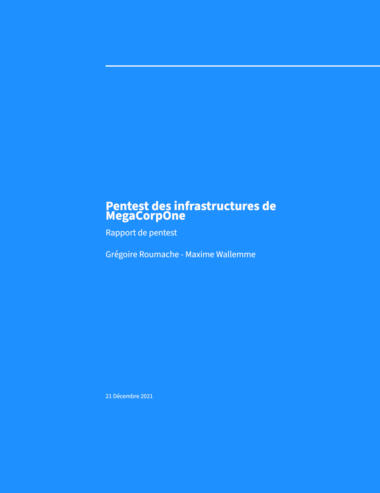
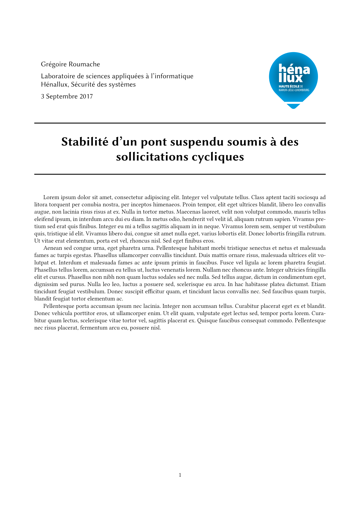

# Grégoire Roumache's latex templates

Here are some of the templates I used for my notes, reports, etc.

- [Travail de fin d'études](tfe/tfe.pdf)
- [Bullet points notes](bullet-points.tex)
- [Pentest report](rapport-pentest/rapport-pentest.pdf)
- [Long school report](rapport-henallux/rapport.pdf)
- [Short school report](petit-rapport/rapport.pdf)
- [Separate the .tex documents in multiple files](multiple-tex-files/)
- [To draw a tikz diagram](tikz-diagram.tex)

